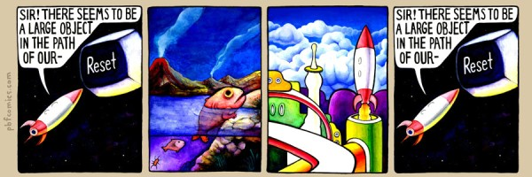

It's a sunny morning, you feel great, you take your dog for a walk. Everything looks gorgeous, and you feel truly inspired.
You feel like nothing could change your mood, until the moment when you stop at the front door of your home and you realize: _you forgot your keys_.

This true story happened with me a couple weeks ago. What really drives me crazy about it is the fact that this
already happened before (TWICE), and, perhaps, it will all happen again! Haven't you ever feel like your life is a succession of blocks that get repeated from time to time?
The same mistakes, the same reactions... **Are we inside a goddamn loop?**

It makes sense. Imagine our life is a loop, with some nested loops inside it. We have a routine that we follow every day, over which we have control - _inside scope_. We have control over our nested loops, but we don't know what's coming next, in the bigger scope.
There is data coming all the time from the outside loop, but sometimes we just don't know how to interpret it. We don't have direct access
to other people's loops, but we can exchange data in many ways.

#### The Eternal Loop?



The [eternal return](http://en.wikipedia.org/wiki/Eternal_return), or eternal recurrence, is in fact a very old concept that was revisited by Nietzsche
in many of his works. It suggests that, although time is infinite, all the rest is finite, so there are a limited number of events and "configurations" that can
take place. One day, eventually, everything will get repeated.

The eternal return - or eternal loop, for us - is a recurrent idea in [fiction](http://tvtropes.org/pmwiki/pmwiki.php/Main/EternalRecurrence). When Neo talks to the Architect (Matrix Reloaded), he finds out that he is not the first,
and he probably won't be the last.

> "The matrix is older than you know. I prefer counting from the emergence of one integral anomaly to the emergence of the next, in which case this is the sixth version." - The Architect

In Battlestar Gallactica, the eternal return is known as _the cycle of time_. It's part of the colonial religion, but many characters, including the Cylons, repeat this emblematic sentence:

> "All this has happened before, and all this will happen again." - Six

#### The Metaphor

If you think about all the things that get repeated in our lives, you'll notice that, in fact, they are not exactly equal - but, in essence, it's all the same. I forgot my keys before, but that
was the first time I was with my dog. Doesn't it look like a game, where you have little variations to increase difficulty, but it's all virtually the same thing?

These small variations represent the antagonism you need to face in order to evolve. So you can go to the next level, with new challenges - which doesn't mean the _old challenges_
won't ever appear again. But now you are more experienced, so theoretically you will do better. The loop never ends.

As with many other philosophical ideas, the _eternal return_ is a strong metaphor for life. Because, basically, _repetition_ - or practice - is the most effective way of learning.
 It builds self-confidence and self-awareness.

Don't see it as a circle, where you will necessarily reach the starting point again. This is _almost_ true, it only
misses one **_axys_**. If you consider the _eternal return_ as a **spiral**, things make much more sense - you will reach the same **x** point, but with a higher **y**. So, eventually, you will reach the top.

#### The Message

If you notice that something, some situation, is constantly getting repeated in your life, it's already a good sign - it's like realizing you are walking in circles (the earlier you notice, the better).
Try to remember what you did before, what didn't work, and what you can do differently this time.

#### How I got inside

After the second time I got locked out, knowing that it would probably happen again, I left a "secret mechanism" to open the door from the outside. I have to slip my hand through the letter box opening,
it's very tight and it hurts my wrists really bad, makes me look like either an idiot or a thief (or both), but it works.