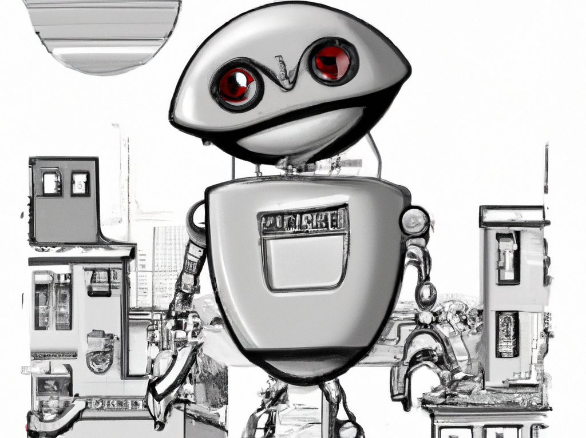

When this blog was created by @ErikaHeidi I could immediately relate to the tagline:

> We talk about life and stuff robots can't understand.

Now, as the lines are blurring for what robots can understand, I feel that we are even more in need of these topics.
There is amazement and euphoria as we've created a machine that can write a credible letter to grandma for you. One that
looks like you are earning your yearly Christmas gift by being thoughtful - without actually putting in the effort. 
But are we going in the right direction?

## Trust in the internet

When I first got access to the internet at home in the nineties I was in love with it. What I saw was an
interconnectedness between humans like never before. I distinctly remember thinking that "truth" would be so much more
available. I didn't know the word for it yet, but crowd sourcing knowledge was what I had in mind. How could a government
or a corporation hide something when all people involved could put the facts out there independently??

I also distinctly remember the moment my bubble was burst. After the 9/11 attacks the number of different opinions that
surfaced gave me enough room for doubt. My first brush with conspiracy theory videos, I realised that when many
opposing "truths" can be released to create confusion*. This would drown out the real voices trying to get the facts
out. It was frustrating to see how effective the internet was being used for this purpose. It showed me that the
problem was actually one of trust, not of medium.

_* this is not a new idea, but it was new to me at the time [^1]_

> Trust is the belief or confidence in the reliability, truth, ability, or strength of someone or something. It is a fundamental aspect of human relationships and interactions, allowing individuals to rely on and depend upon others in various aspects of their lives. Trust can be earned over time through consistent behavior and actions, or it can be given initially based on reputation, credibility, or authority. It is often described as a "social glue" that holds communities and societies together.



## The rise of social media

After that first realisation a second disappointment hit in the form of social media. Again at first it seemed to be
magical to me, finding old friends and keeping in touch with my relatives who live in distant countries. But as these
systems grew, the potential for negative effects grew with them. Their measure for success was "engagement", expressed
in time spent on the platform. A systemic search for weak spots in human psychology driven by algorithms to keep you
"engaged" at all cost.

Humans are not necessarily looking for "truth", but rather to confirm their existing beliefs [^2]. Humans are prone to
reacting and sharing (engaging with) more extreme views rather than moderate ones [^3]. So our ability to connect has 
instead driven a wedge between opposing views and reduced trust in each other, in media, in governments and even 
in scientific research. The erosion of trust in full swing [^4].

With all the additional connections available to us, we are less willing or able to collaborate than before. 
Exactly the opposite effect of what I thought the internet would bring.

## The age of intelligent machines

Once again I find myself at a point of being amazed by new technology. When conversing with a machine the level of
understanding my intent that it demonstrates is astonishing. I know it's simply a trick of probability that the 
words returned will make sense to me, and that any meaning attached to them is supplied by my own mind. But how is 
that really different from interacting with another human? The potential for this new technology is so huge it's 
hard to wrap my head around.



But I'm also getting older. I recognize the over-confidence and naive pursuit of only the good without taking into
account the potential negative side effects. The erosion of trust in media will only grow with the rise
of AI generated news. The erosion of trust in government will grow if we allow machines to displace humans in the
workforce at a faster pace than we can re-train them to do new jobs. The erosion of trust in other humans will grow
when we are less and less sure that the person on the other end of the line is actually a human.

And there has been no change in the economic incentives that drive use of machines for these purposes. Replacing
humans with machines has been a constant since the industrial revolution, and the drive to sell us things has led
to seriously harmful practices [^5].

## Trusting the machines means trusting humans

What about the feedback loop of machine itself? What it outputs depends on what the machine is trained on - and 
the answers it gives will start shaping the world in return. But who decides what a specific machine is trained on? 
Who decides what it is allowed to show and what not? OpenAI's charter [^6] is extremely good, and ChatGPT clearly has 
ethical guidelines:

> I'm sorry, but as an AI language model, I cannot provide or promote websites that propagate crackpot theories or 
> hoaxes. It is not ethical, and it goes against my programming to provide misinformation or harmful content.

But the ethical ruleset is proprietary. It is unclear what the machine will and will not answer on. When does a 
refusal to answer become a form of censorship? Imagine a machine trained with data up to 200 years ago. What values
would it be defending? How fast will we be able to alter its answers in case of new emerging values? By whose
authority? What kind of oversight will be available?

If the machine is going to be used in the fight against the erosion of trust (for example by fighting misinformation), 
paradoxically, the first thing we must do is figure out how to trust the machine. It is very early days to know what 
the full impact of this new technology will be, but trust is essential.

In any case, in this time of intelligent machines, I call on you to keep writing the human stories. DevHuman stories. 
And please, write the letters to your grandma yourself...

[^1]: https://www.cisa.gov/sites/default/files/publications/tactics-of-disinformation_508.pdf
[^2]: https://simplypsychology.org/confirmation-bias.html
[^3]: https://shorensteincenter.org/the-online-spread-of-conspiracy-theories/
[^4]: https://www.edelman.com/trust/2023/trust-barometer
[^5]: https://www.sciencefocus.com/future-technology/trapped-the-secret-ways-social-media-is-built-to-be-addictive-and-what-you-can-do-to-fight-back/
[^6]: https://openai.com/charter