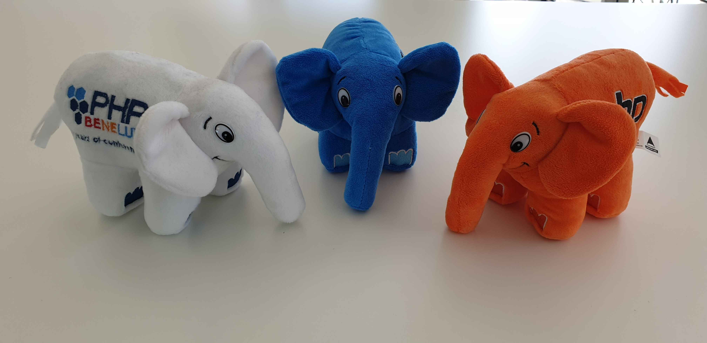

I will explain why I find the most forgotten PSR, PSR-8 is important for the community to keep in mind.

In the PHP community we can debate a lot about code and anything related. If it isn't about a new language feature then it is about frameworks or the use of finale for a class. And that isn't bad, with honest conversations a debate can be a good learning opportunity. Not only for the people debating but also for other who are watching (or reading) the debate.

Where things are starting to get worse is people wanted to "win" a debate. Or won't (or can't) understand that other people have another opinion and preference.

Sometimes it looks like they forget that the person that use *<framework X that I don't like>* is another developer who creates the same kind of nice applications. Or that person who thinks different about *<option Y where I have a strong opinion about>* have other experience. And in the end they all are human beings not only a name with picture/avatar on a screen. And that is why I find that PSR-8 is important to keep in mind.

## PSR-8

For who don't know the [PSRs](https://www.php-fig.org/psr/) it is a set of standards for PHP created and maintained by the [PHP-FIG](https://www.php-fig.org/). You likely use the [PSR-4](https://www.php-fig.org/psr/psr-4) for autoloading and possible others for coding style or interfaces. The [PSR-8](https://github.com/php-fig/fig-standards/tree/master/proposed/psr-8-hug) is a little bit strange because the title is Huggable Interface. And the code doesn't look like very usable in a project. **But that isn't the point!** We as human beings need to share more hugs, this can be literal (only with consent) or digital. With more human touch we can build each other up instead of tearing each other down. That will empower the community to do even more great things then it already does.

## How do I do it

First, I'm not holy I also make mistakes. For me it is important that If I found out that I do something that hurts someone I have to say sorry. Saying sorry will not always help or fix the situation but showing your regret is a good try.

### Stay friendly

The most important thing is to remain friendly. If you feel you can't be friendly on that moment maybe it is a sign to not react on that moment. If you are unfriendly it isn't fair to expect a friendly reaction. And if the other is already unfriendly it can be a choice to not react, your reaction isn't required.

### Postcards

Another thing I found out that can help is sending a postcard. If I get the feeling someone has a difficult time and can use some hugs, I try to send a postcard. I use the image below that contains 3 cuddly ElePHPants. Below the image I write A lot of PSR-8 implementations for you! and inside the card I write a personal text.

The most difficult part is to get the address where to send the postcard to. If the person has a company (or freelance) it is most of the time possible to get the address from a register. If not, I try to contact someone who could have the address.  To be real, getting the address is sometimes the part where it failed. If I succeed in getting the address, I let [Hallmark](https://www.hallmark.nl/ "Hallmark") do the printing and sending. Depending on the location it can take 2 weeks before the card will arrive.

## The community is great!

The reading above can give you the idea that the PHP community is horrible, it isn't! Online you can see some bad examples and sharpness that doesn't always looks good. But if you visit a local meetup or a conference you will see an open and welcome ambiance. And there are a lot of online slack/discord/telegram/... groups where you can learn a lot in a friendly way. Besides that, I have seen initiatives where someone in the community was in a tragic situation. Because of that he/she was in need of some money and people all around the world helped. That is also great community work.

The community can be like the ElePHPant it is big and looks huge but if you are friendly it can give you soft hugs.

So, think about the PSR-8, give someone a (virtual) hug and stay friendly!