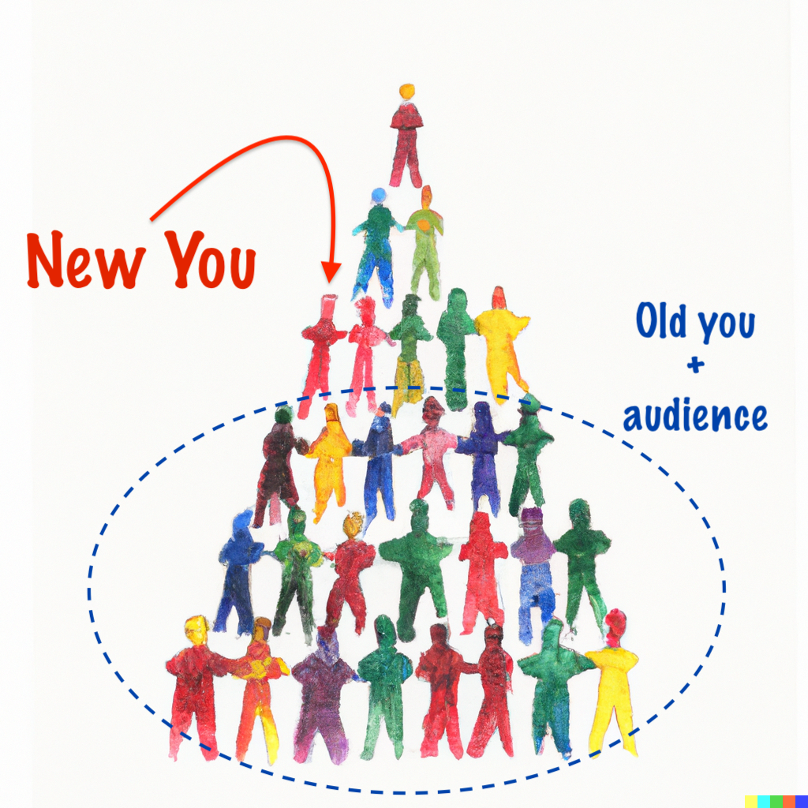

_Warning: This post has nothing to do with the [movie by the same title](https://www.imdb.com/title/tt11286314/). I 
do highly recommend watching it though._

In the short time I've been alive in this world I've gone through a handful of profound changes in perspective. The 
latest one has been slumbering in the background for a while. It goes to the heart of my personal productivity, 
or rather the lack of it.

My general feeling of being unproductive is not new. I've been struggling with it for a long time. There are many 
bestseller books on the topic, like 

- [Eat that Frog](https://www.bol.com/nl/nl/p/eat-that-frog/9200000059295510/)
- [Getting Things Done](https://www.bol.com/nl/nl/p/getting-things-done/9200000107679892/)
- [The 4-Hour Workweek](https://www.bol.com/nl/nl/p/the-4-hour-workweek/1001004006428399/)
- The 5 AM club *.
- etc..

Given the [success of the genre](https://www.bol.com/nl/nl/s/?page=1&searchtext=procrastination&view=list&filter_N=8292+11209+14033&rating=all) 
I'm certainly not alone in this feeling. I've watched the TED talk 
[Inside the mind of a master procrastinator](https://www.ted.com/talks/tim_urban_inside_the_mind_of_a_master_procrastinator) 
by Tim Urban more than a few times (usually when I needed to be doing something else). It's hilarious. And it's 
also very relatable.

_*I don't recommend "The 5 AM club", I found it a very shallow book_

## How to be more productive

What those books and talks have in common is that they all focus on the "how" of productivity. They give you tips on
changing your routine or your habits. And this has certainly helped me in the past - 
[Atomic Habits](https://www.bol.com/nl/nl/p/atomic-habits/9200000075132383/) by James Clear has had a profound effect 
on how I arrange my day. I have a morning routine that I follow consistently and I have been able to stack a few habits 
on top of each other. I've read many books starting from a "read 15-minutes at breakfast" rule.

But I have not been able to apply these techniques to all areas I wanted to. I've got a bad habit of staying up late 
when I know I should go the bed. Sometimes I play games on my phone that I know I don't enjoy. But most importantly for 
me, I've been trying to do more writing for a long time. But I can't seem to find a rhythm that works for me.

## Not _how_, but _why_

So instead of focussing on **how** to be a more productive writer, I decided to look into **why** I'm not writing more.

For instance, I know that I am not incapable of writing. I have no problem articulating an idea once I have a good 
grasp of it. Making an idea public can be nerve-wrecking for me, but at the same time I know I can do it. I've done it 
before. As for finding the discipline - I'm sure I can do that too. I made quite a few changes in my life over the 
years, and I've been able to stick to them.

So if I'm not too scared , too dumb or too undisciplined... what is holding me back?

It has to do with the fact that deep down, I believe that _my ideas are not worth sharing_.

### My ideas are not interesting

After introspection, I think for me this is a matter of the audience in my head. I've spent a very long time 
"looking up" at people who are more successful, more creative, more knowledgeable than me. I aspired to be more like 
them, and to do so be as close to them as I could. This has helped me a lot in my career, I've been very fortunate to 
be around people who are smarter than I am. This is, in my experience, the fastest way to learn and grow.

But if you're constantly looking up, all you see is those ahead of you. You seem to lose track of your old self, the 
one who was just behind where you are now. Because thát you is surrounded by others at the same level of experience. 
And still ahead of even more others - all the way down to those who are just starting out. And this is an audience 
I was not taking into account.



### I have nothing to add

A lot of topics I came up with over the years never became a blog post because I felt that I was not the right person
to write about it. There was always someone who I looked up to who could do a better job. And even for topics 
I stared to write about, I would do research and find that someone else had already written about it. I would assume 
I was not adding anything new to the conversation, and I would stop writing.

But it is very telling that I've never thought about it the other way around. The articles I found might also not 
be the original sources - but I never check. The authors I admire might have taken topics from others, but I assume 
their views are worth it without comparing. It's not needed. If I learn something new then it was worthwhile _to me_
as the reader. Maybe their wording was just right, or the examples were more relatable. Maybe I wasn't even aware of 
the topic until a particular author decided to write about it and share. The point is, they shared.

### I _must_ sound smart

If I did manage to write something I would start to get discouraged when I read it back. I would imagine the people
I look up to as readers and assume they would find it too simple or too obvious. A lot of my time would be spent 
re-writing until at some point I would give up. You're never going to write an interesting article about "the 
inner-workings of the pinball machine" if you're trying to write to the inventor of the pinball machine, right?

But even that seems wrong. It might be that the inventor of the pinball machine is very interested in my experiences
with them. Or even my description on how they work, either because I got it wrong or because my views inspire new ideas.
Or maybe they are not interested at all, but someone else probably is. And that's the point. Don't try to write to 
the inventor, write to the person who is interested in the topic. Write to the person who is either just starting out 
or is just behind you. Write to the person who might be out there looking up to you. Write to old you.

## Don't look up

So the advice I have to me from my future self (the one who writes more than me) is:

Don't look up!.



At least not when sharing knowledge. The fact that I actually wrote this article makes me hopeful that I'm on to something :-)

