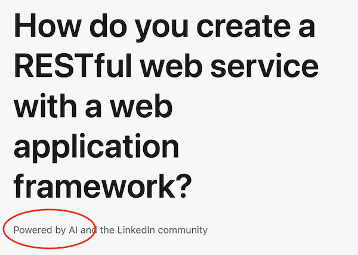

This week I received a notification in my LinkedIn inbox. It was an invitation to collaborate on an article,
and naturally my first thought was "OMG I'm finally  getting recognized for the quality of my writing!". I clicked 
the link to see what exactly was being asked of me, and see what made me such a good fit for this article.

## Powered by AI, but how? 

The first thing I noticed on the page that I was taken to was a by-line under the title: 



So some part of this article makes use of AI somehow, but there is no further explanation.
The page itself is split into two columns, where on the left are headlines and some text, and on the right side are
comments from other people. Notably, the left side has no author.

In the example article, the first block of text ends with:

> In this article, you will learn how to create a basic RESTful web service with a web application framework in six steps.

The six steps are the headlines on the left:

- Choose a framework
- Set up the environment
- Define the resources
- Implement the routes
- Write the logic
- Test and deploy

## Wait... what?

This list of 6 steps is so generic, it reminds me of the "Draw an owl" meme:

Each block has a single paragraph under it. This borders on the absurd. If you where able to cover a topic as diverse 
as the creation of a RESTful web service without a specific language or framework specified, it would certainly take
more than 6 paragraphs. And even the paragraphs themselves are void of any real content. The first paragraph under 
"Choose a framework" reads:

> The first step is to choose a web application framework that suits your needs and preferences. There are many 
> options available, each with its own advantages and disadvantages. Some of the most popular frameworks for 
> creating RESTful web services are Flask, Django, Express, and Rails. These frameworks are written in different 
> programming languages, such as Python, JavaScript, and Ruby, and have different levels of abstraction, flexibility, 
> and complexity. You should consider factors such as the learning curve, the documentation, the community support, 
> and the compatibility with other tools and technologies when choosing a framework.

I challenge you to find a developer of _any_ skill level to use this generic statement to make a decision on which 
Framework "suits their needs and preferences". It's a completely empty statement. And none of the other 5 steps is
any better. It's clear that the entire left-hand side is generated by what we now refer to as "AI"; a 
Large Language Model.

So what is the point of this article? It's not to inform, because it doesn't. It's not to entertain, because it doesn't.
The only purpose of this article is to "exist" so that it can be indexed by search engines.

The community-driven comments on the right side are solely there to make it look like there is some kind of discussion,
driven by the egos of the "invited ones".

## It is really such a problem?

This particular example is one of the less problematic ones. There is a very slight chance that the generated 
content + comments will yield some value to someone. More vile examples use generative AI to purposefully cheat people
out of their life savings. These pages do not seem to do any harm, right? But it will not take long 
for the commenters to jump on to the automatic generation bandwagon. In fact, I'm 100% sure that some commenters are 
already automating their comments. And then the whole thing degenerates into fully auto-generated content taking 
up resources in the form of actual generation by AI, storage and bandwidth, indexation by search engines and the 
wasted attention of people who are looking for actual information. The problem becomes worse as all this content 
will at some point be ingested as real training data for an AI system in the future.

Henry Thoreau wrote in Walden:

> It is not the tailor alone who is the ninth part of a man; it is as much the preacher, and the merchant, and the 
> farmer. Where is this division of labor to end? And what object does it finally serve? No doubt another may also 
> think for me; but it is not therefore desirable that he should do so to the exclusion of my thinking for myself.

It seems visionary that he wrote in 1854 about how "thinking" would be replaceable. Granted, he was probably not 
talking about machines. But given that he wrote it in the chapter called Economics and referring to the division of 
labor, I'm sure he would have been abhorred by the current gold-rush involved with "replacing human thinking". Here 
he is texting about it:



The "problem" LinkedIn is currently solving is getting a high ranking in search engines. Or maybe soliciting 
members to provide more free content with as little effort as possible. There are currently twenty-something topics
on LinkedIn with maybe a hundred articles each. That's 2500 pretty much useless pages and if this "works", we can
expect the number of pages to increase soon. And every other platform to follow suit. 

The benefits of content generation only exist in the current system (of monetization), and only the first ones to
implement these mass content-generation tricks will benefit. The creation of useless pages with zero value to
humanity that provide value for an individual or a company will eventually damage the system as a whole, a digital
version of the "commons dilemma".

The resulting mass of auto-generated content that is coming at us soon is - I believe - going to overwhelm what we 
currently have as a system to filter out the noise. Human curated sources like "The syllabus" might be a path to 
the future, but in our current digital environment these are rare and maybe also not capable of dealing with the 
increased input either.

One of the most hilarious (in a sad way) things in the current landscape is the fact that AI companies are also offering 
their products as the solution. Because "AI could filter out the AI generated content"... If that is the solution then 
all I can say is: *AI AI AI*.

## So it really is such a problem...

There are very specific areas where I believe AI assisted content generation can be of great value. Especially in 
the areas where there is a big gap between the number of communicators and the number of listeners, for example 
education.

If AI can help teachers write material... and it can help students understand that content by adapting to their 
way of learning, helping them see what they do not yet understand or have an incorrect notion of. That way we 
leverage the power of AI to lift human knowledge to a higher level.



In the meantime, I think using AI for "individual productivity" is not unreasonable. We might be a little obsessed with 
productivity in our current society (if only we had a good idea of what to do with all the saved time). But if using
AI improves your life then why not - unless you're currently figuring out how to automate LinkedIn comments on AI 
generated articles of course. 

I'm writing this article with an AI plugin in the editor (CoPilot) that finishes my sentences like an understanding 
partner. Sometimes the completions are total rubbish, but even then the appearance of an incorrect statement can 
trigger my response and keep my writing "in motion". Some suggestions are good and kept in place. Very rarely 
does a suggestion truly change the intended purpose of an article, a paragraph or even a sentence. I still consider 
my article "human written".

When the reason to use generative AI is to "minimize your effort", realize that the effort is part of the 
equation when it comes to social interaction. Your comment on my article is valuable because I know you spent 
time on it. If you optimize that away through automation the value of that interactions is reduced - 
in fact the value of _all_ interactions is reduced because nobody can be sure that any response cost any effort. 
(I already wrote about the  
resulting from auto-generated supposedly-human interaction).

Let's make sure we don't erode so much trust that we fail to benefit from AI. I'm sure it's here to stay, but we 
should make sure we enjoy its company.

---

_References_
- ["Walden", Henry Thoreau](https://en.wikipedia.org/wiki/Walden)
- "Can Generative AI bots be trusted?", ACM magazine, June 2023 vol. 66 No. 6
- [The Syllabus](https://www.the-syllabus.com/)
- [AI is killing the old web, and the new web struggles to be born](https://www.theverge.com/2023/6/26/23773914/ai-large-language-models-data-scraping-generation-remaking-web)
- "Can Universities combat 'The wrong kind of AI'?", ACM magazine, december 2022, vol 65 No. 12
- https://www.digitaleoverheid.nl/nieuws/departementen-werken-samen-aan-visie-op-generatieve-ai/