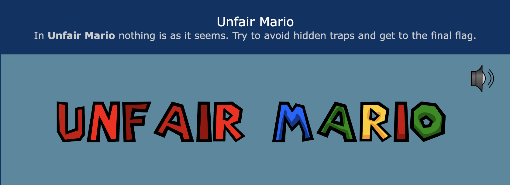

I have a hard time explaining some of the best practices in software development, even to developers sometimes.
Usually this happens when I'm trying to convey a feeling. Using words in these cases is inadequate because it lacks 
the emotional context that is needed to understand the message.

## Fear of releasing on a friday?  

Let's use an example. Fear of "releasing on a friday" is common in software development. It's not really about friday 
of course, but about the confidence that you have in the software you are releasing. Maybe you did a small change 
that only affects a tiny part of the system. Maybe you worked together in an ensemble/mob programming session and your
whole team agrees that the change is good. Maybe you have a series of test-suites with 100% coverage that all passed.

Whatever you base your confidence on, it's still a feeling which is hard to convey with words. Any _new_ team member
will need to experience this feeling themselves before they can understand it.

## Explain it to me like I'm a five year old

Let's say you come from a job with very high confidence, backed up by a lot of automated tests. You join a new team
where they have no tests at all. This team might not release on a friday because it makes issues harder to fix 
(since they occur over the weekend with fewer people around). This way of working is perfectly valid, but for you
it's just as hard to release on a tuesday... Because what you lack is confidence in the software, most of which 
is unfamiliar to you.

How do you explain the difference in experience between your previous job and your current job to your colleagues? 
For them, this is the status quo! What you are trying to do is to convey a feeling. Even worse, you are trying to 
convey a feeling that is **not** present. 

"You should not touch this item because it's hot" will only make sense after the experience of hot and *ouch* exist. 

## Games are sculpted experiences

A game is a mini-system that has the potential to evoke specific feelings. This is what makes games enjoyable, but 
it also makes them a powerful tool for communication.

Instead of trying to explain the feeling of confidence, you could do a team session of playing [Unfair Mario](https://www.unfair-mario.com/)
_(feel free to play now, I'll wait. But be warned... it's unfair)_

After you and your team have played, reflect on the experience together:

> What did you feel? (this can be a whole list of emotions like frustration, anger, joy, etc.)

> Are there any parallels between the game and your work? (use the emotions as a starting point)

> If you could, how would you change the game to make it safer? Are those changes possible in your work?

## Terrible games

I absolutely love games that break the rules. 

Unfair Mario us such a game, because the system is not consistent with the rules that you "know". A solid block is 
not always safe to walk on. Sometimes you have to make a counter-intuitive move to progress. There is not much you
can do to prepare for the next step, because previously safe moves are still potentially dangerous.

At the same time, it does follow other rules of game design. Your own actions within the game are dependable. If those
where also inconsistent (we might call that game Drunk Mario) it would make the experience much more random and 
therefore less enjoyable. The provided check-points and levels guarantee at least some progression. Without these 
elements, increasing frustration would make players quit a lot sooner. 

These are all elements that exist in "the real world". But by playing a game, you can experience them in a safe 
environment (even if the game is called Unfair Mario 😬). 

## Keep playing!

Remember that having fun isn't something you do "in your free time". It's a state of mind that you can bring to work 
as well.

Keep playing!