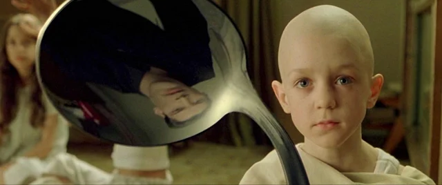
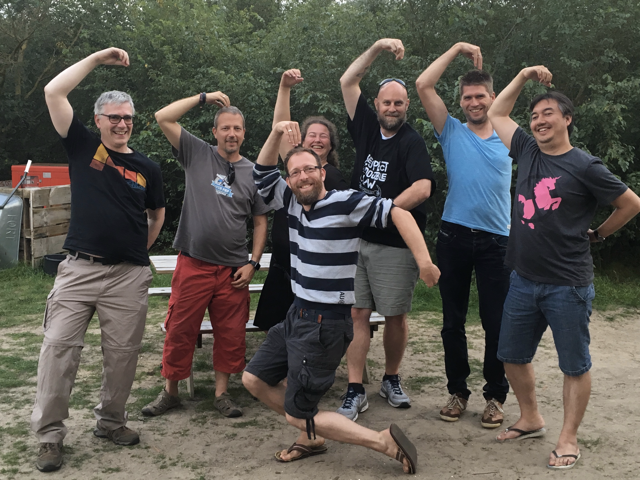

I watched an incredibly bad movie this morning. It was bad, because it consisted of so many individual fragments there
seemed to be no story to it at all. It was like a fever dream, featuring flashes of faces, half finished conversations,
a flurry of places, food, people, a Panda and a Tiny Dragon (wtf?)... in no particular order.

## Then why did you watch it??

I watched this movie because I could not stop it. It was projected directly on my brain - a result of processing the
experience I just went through having visited the
 for the past 4 days. But I did have a
choice to watch this movie without trying to follow the plot, narrate the scenes or make any sense of it at all.

So I simply sat with it*

_*actually, I was doing the laundry. But you get the idea._

## A story emerges...

Letting this movie run freely without examining each flash started to make some more sense after a while. And without
actively trying to push it, the movie appeared to contain an interesting story after all.

It features a man searching for meaning and purpose. He is trapped in a shrinking bubble he does not know how to
get out of. Imagine a pantomime, frantically searching but never finding an exit.

## What magical place is this?

Then, gently pulled in by a Big Panda and a Tiny Dragon, he visits a new place... This odd place is filled with other
souls who all float so freely... and seem to have no problems with their bubble at all.and with each new interaction,
conversation and new face - his bubble seems to expand. There are insightful sessions, playful moments, games, deep
connections, trust, safety and a particular kind of exhaustion that he has not often reached.

As his bubble grows, there is suddenly room for him to breath. He takes a huge breath and lets it out slowly...

And he realises that he'd been holding his breath. He'd been holding his breath for so long... **way too long**...

And then he cries. It is an ugly cry, but a much-needed one.

## The end.

Then the movie finally ends. Apparently, these movies know when they have served their purpose. And I know one thing for
sure: not a _single one_ of the frantic flashes were in any way negative. Hectic and tiring as it may have been, every
moment had some positive effect - be it the opportunity to learn somehting new, help someone else, sit alone to reflect
or even take a nap.

No, actually, I now know **two** things!

I must not try to push the bubble. That's impossible. Instead, I must only try to realise the truth: there is no ~~~
spoon~~~ bubble.

## Teaser for part II

This was an incredible experience that will be very hard to live up to! But I feel that many of the other first-timers
at the event had a similar experience (and the fact that many people revisit many times over) makes me very optimistic
for the sequel.

Maybe I'll feature in **your** movie next year?

## PS.

After the movie was over I realised that I had actually watched it before. Going through the archives I re-read my
posts on [WeCamp14](/2014/08/a-journey-of-emotion-at-wecamp14/)
and [WeCamp15](/2015/09/i-camp-you-camp-we-camp-at-wecamp15/), and it is clear to me that this was a very, very similar
magical place! (there was even a slight revival of Rrrrrramón)

Unfortunately, WeCamp was lost to Covid-19 but if you where there then I can promise you: you will not regret visiting
Play4Agile27!

