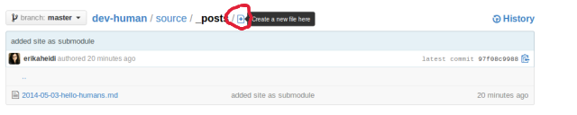
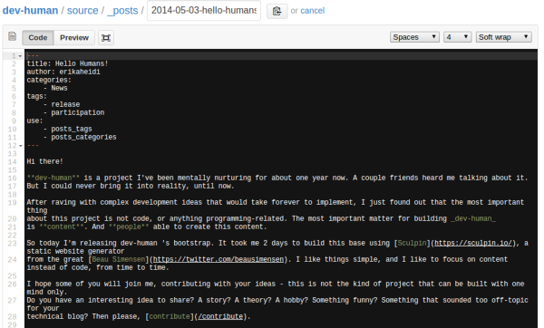

Basically, you only need to create a Pull Request. An article is just a markdown file with some specific metadata information
(title, authors, categories) that will be used to generate the static files in the website. This page contains detailed instructions on how to submit your article via GitHub,
without the need to clone the repository locally. If you want to run the project in your local machine,
in order to preview how the article will look like when published, please check the section [Running dev-human locally](/docs/running-locally).

### 1. Fork the project to your GH account

Head to our main repository on GitHub: [https://github.com/dev-human/dev-human](https://github.com/dev-human/dev-human).
Click on the "Fork" button and follow the instructions.

### 2. Navigate to the "article" folder, in your forked repo

Go to your forked repository. Navigate to the folder `content/article`. This is where all articles are located. 
You'll see a small plus sign icon that you can use to create a new file in this folder:

Click on this button and a new page will show up where you can define the file name and edit its contents. 
Now you'll need to follow some basic guidelines in order to create your article.

### 3. Set the File Name and Article Meta Data

The file name will define the article date and _slug_ (used in the permalink). For instance, the file 
`2014-05-03-hello-humans.md` will generate an article with the following permalink: 
`https://dev-human.io/2014/05/03/hello-humans`.

The article title, categories and other meta data are defined in a special block, the article _frontmatter_ . 
It uses YAML, so it's very straightforward.

This is a template you can use to create a new article:

~~~~
---
draft: true
title: Your Article Title
source: http://url_to_original_post_if_applicable
authors:
    - your_author_handle
categories:
    - Category 1
    - Category 2
tags:
    - Tag 1
    - Tag 2
    - Tag 3
---

Your article content goes here. Do whatever you want with markdown.

~~~~

* **title**: The Article title
* **source** [optional] : if your article is a republication (you had published it somewhere else first), provide the original link
* **authors** : One or more authors. When rendering the article, we'll fetch data from the **authors list** based on the identifier you use here .
* **categories** : Post categories. Its preferred that you use 1 to 3 categories.
* **tags**: Post tags. Use as many as you feel like.
* 
* **draft**:  true or false. This determines if the article will be published to production (draft: false, or not set at all) or only to staging (draft: true) 

To see a real example, check the [published articles](https://github.com/dev-human/dev-human/tree/master/content/article) folder in our repository.

Now **commit** the changes to save the file in your forked repository. When you open it again, GitHub wil automatically detect the markdown
extension and provide a pretty neat markdown editor so you can write and preview your article.

### 4. Edit the file and write your article

No go to your recently created file, and click on the "Edit" button. You can now edit your file and use the _preview_ functionality to see how it looks like.

If you need some help with markdown, have a look at this very useful [markdown syntax guide](http://daringfireball.net/projects/markdown/syntax).

### 5. Add your info to "authors" (optional)

Create a new file called `data/authors/[your_author_handle].yaml` in your forked repository. This configuration file has the list with all authors.
This step is not mandatory, but it will add at the end of the post a nice box with information about the article author, **YOU**.
You just need to add an item to the array, using the same author handle you used for the article meta data.

It should look similar to this:

~~~~
name: Erika Heidi
avatar: https://pbs.twimg.com/profile_images/451042845206380545/0GHPdHhs.jpeg
bio: independent web developer && open source enthusiast.
~~~~

Naturally, you only need to do this step once.

### 6. Pull Request

When you are done, open a pull request to **dev-human/dev-human**.
